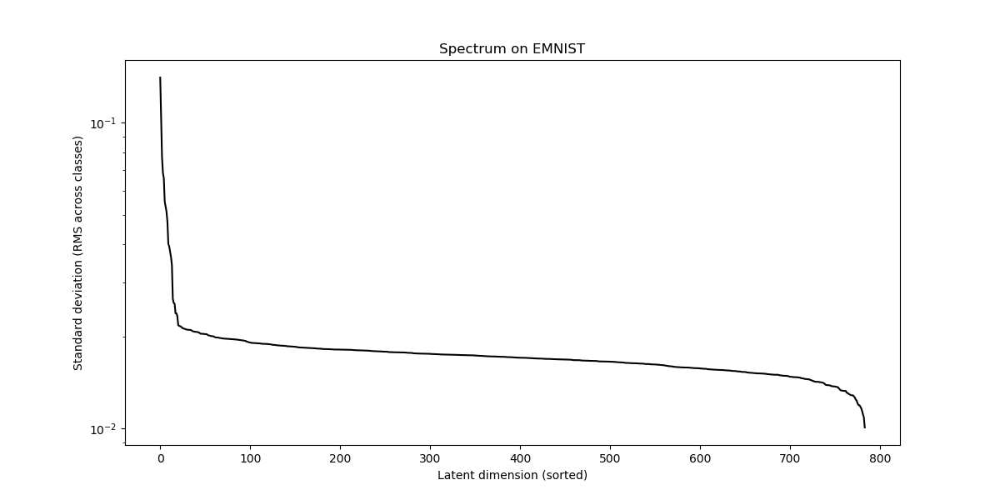
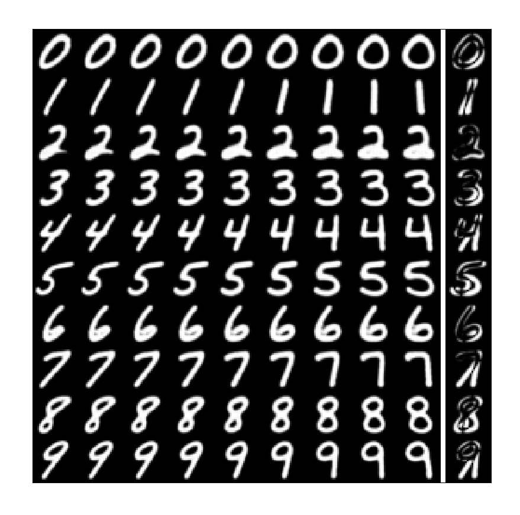

# GIN
Code for the paper <a href=https://arxiv.org/abs/2001.04872>"Disentanglement by Nonlinear ICA with General Incompressible-flow Networks (GIN)" (2020)</a>

## Prerequisites 
First install <a href=https://github.com/VLL-HD/FrEIA>FrEIA</a>:

```shell
pip install git+https://github.com/VLL-HD/FrEIA.git
```

The scripts in this repository were tested with the following package versions (may also work with earlier versions, eg python 3.7):
- **python** 3.8.3
- **numpy** 1.18.1
- **matplotlib** 3.1.3
- **pytorch** 1.5.0
- **torchvision** 0.6.0
- **cudatoolkit** 10.2.89

Tests were made with both CPU (artificial data only) and GPU (artificial data and EMNIST).

## Usage
Clone the repository:
```shell
git clone https://github.com/VLL-HD/GIN.git
cd GIN
```

### Artificial Data
To see the available options:
```shell
python artificial_data.py -h
```

Reconstructions are saved in `./artificial_data_save/{timestamp}/figures`. Eight reconstructions are plotted, each corresponding to a different orientation of the reconstructed latent space.

Example reconstruction plot:


### EMNIST
To see the available options:
```shell
python emnist.py -h
```

Model checkpoints (.pt files) are saved in `./emnist_save/{timestamp}/model_save` with the specified save frequency. Figures are saved in `./emnist_save/{timestamp}/figures` whenever a checkpoint is made (including at the end of training).

Example plots:




For further details please refer to the <a href=https://arxiv.org/abs/2001.04872>paper</a>.
